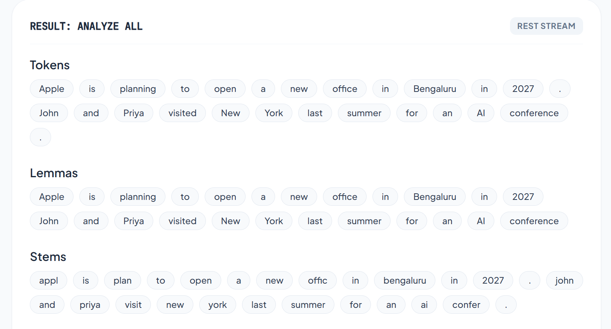
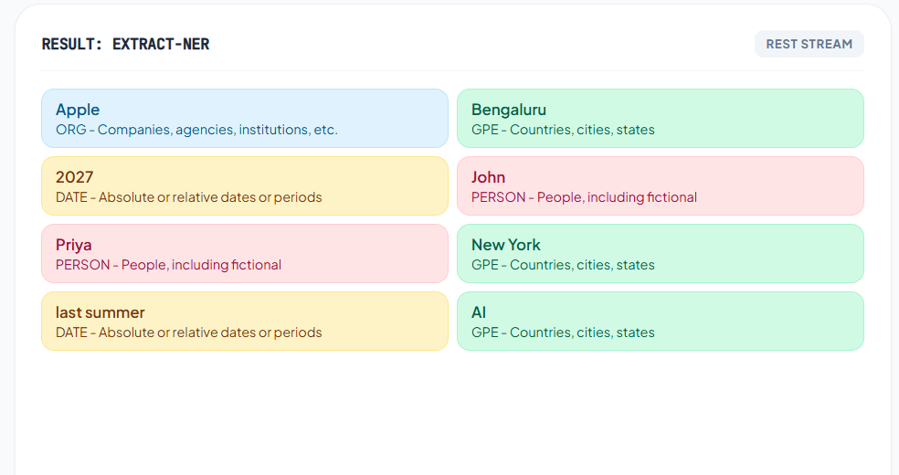

# NLP Preprocessing & Embeddings Application

A robust FastAPI-based backend application for performing advanced Natural Language Processing (NLP) tasks and vector space analysis. This project provides a modular, thin-route API for lexical parsing, string normalization, and TF-IDF document embeddings.

## Features
- **Lexical Analysis Pipeline:** Tokenization, Lemmatization, Stemming (Snowball), Part-of-Speech (POS) tagging, and Named Entity Recognition (NER).
- **Robust POS & NER:** Powered by **spaCy** to ensure high accuracy and full compatibility with modern Python environments (bypassing legacy NLTK/TextBlob pickle constraints in Python 3.14+).
- **Vector Embeddings Space:** TF-IDF based document representation, similarity computation, and 2D visualization capabilities.
- **Unified Pipeline:** A `/run-all` endpoint that aggregates all text transformations into a single, optimized data matrix.

## Project Structure

```text
nlp-assignment/
├── backend/
│   ├── app.py                 
│   ├── models/
│   │   └── schemas.py        
│   ├── routes/
│   │   ├── nlp_routes.py    
│   │   └── embedding_routes.py
│   └── services/
│       ├── nlp_service.py
│       └── embedding_service.py 
├── frontend/        
└── requirements.txt
```

## Installation

#### 1. Windows PowerShell
```bash
python -m venv .venv
.\\.venv\\Scripts\\activate
```
#### 2. Install core dependencies
```bash
pip install -r requirements.txt
```

#### 3. Download the spaCy English model (Required for POS & NER) & NLTK
```bash
python -m spacy download en_core_web_sm

python -m nltk.downloader punkt_tab
```

## Run Backend

Start the FastAPI server via the provided application entry point. This will boot Uvicorn locally on port 8000.
```bash
python -m backend.app
```

## Run Frontend

1. Open your code editor (like VS Code).
2. Navigate to the `frontend/` folder.
3. Open `index.html`.
4. Start a local server:
   - **VS Code:** Click the **"Go Live"** button at the bottom right if you have the [Live Server extension](https://marketplace.visualstudio.com/items?itemName=ritwickdey.LiveServer) installed.
   - **Python (Alternative):** Run `python -m http.server 3000` inside the `frontend/` directory and visit `http://localhost:3000` in your browser.

## API Endpoints
### 1. Lexical NLP Sub-module (/api/v1/nlp/lexical)
- `POST /parse-tokens` - Deconstructs text into atomic tokens.

- `POST /parse-lemmas` - Normalizes words to dictionary base forms.

- `POST /parse-stems` - Trims morphological endings using Snowball rules.

- `POST /classify-pos` - Extracts syntactic grammar categories (spaCy).

- `POST /extract-ner` - Discovers named entities and locations (spaCy).

- `POST /run-all` - Executes comprehensive analysis in a single pass.

### 2. Embeddings Sub-module (/api/v1/vectors)
- `GET /info` - Returns vector space metadata.

- `GET /corpus` - Retrieves corpus documents and their vectorized states.

## How Preprocessing Works (Step-by-Step)
**1. Cleaning & Normalization:** Raw string inputs are stripped of excess whitespace.

**2. Tokenization:** Sentences are sliced into individual words or punctuation marks.

**3. Morphological Analysis:** Words are mapped to their roots either algorithmically (Stemming) or via semantic dictionaries (Lemmatization).

**4. Structural Tagging:** The spaCy engine analyzes sentence structure to assign Grammar Codes (POS).

**5. Entity Recognition:** The model cross-references statistical patterns to label Proper Nouns (e.g., Organizations, Locations).

## Pipeline Output Demo

See how the application processes text into structured tokens, lemmas, and stems:



### Named Entity Recognition (NER) Results
The application identifies and categorizes entities like Organizations, Dates, and Locations:



## Embeddings 
The Vector space module transforms text into numerical arrays so mathematical similarities can be calculated.

**1. TF-IDF Calculation:** Words are weighted by how frequently they appear in a single query versus how rare they are across the entire dataset.

**2. Similarity Matching:** User queries are embedded using the same vocabulary space as the corpus, and cosine similarity is used to find the closest matching documents.

**3. 2D Projections:** High-dimensional TF-IDF vectors can be reduced using PCA or t-SNE algorithms to be plotted visually on an X/Y axis for frontend dashboards.